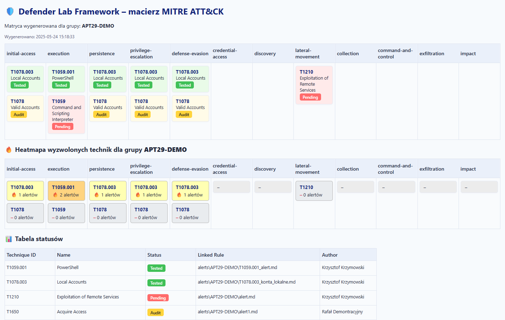

# 🛡️ Defender Lab Framework

**Defender Lab Framework** to modularne środowisko do **budowania, testowania, mapowania i automatycznego raportowania scenariuszy detekcyjnych** na bazie Microsoft Defender for Endpoint (MDE). Pozwala generować dokumentację techniczną, raporty HTML, warstwy do MITRE ATT&CK® Navigator oraz śledzić efektywność detekcji zarówno dla pojedynczych technik, jak i całych grup APT.

> **Modularny framework do testowania i dokumentowania detekcji na bazie MDE w postaci Heatmapy mitre dla poszczególnych grup APT**

  

---

## Do czego przydaje się ten framework?

- **Automatyzuje dokumentowanie i testowanie scenariuszy detekcyjnych** – każde wdrożenie nowej reguły, symulacja ataku czy zmiana w środowisku może być łatwo udokumentowana, przypisana do technik ATT&CK i przetestowana.
- **Generuje warstwy do MITRE ATT&CK® Navigator** (wraz z mapowaniem statusów i score), pomagając w analizie pokrycia detekcji.
- **Tworzy interaktywne raporty HTML** (z heatmapą, statusami i filtrami), umożliwiające szybki przegląd statusu testów, pokrycia technik oraz aktywności powiązanych z alertami MDE.
- **Porządkuje i standaryzuje dokumentację** – scenariusze, alerty, reguły huntingowe, mappingi oraz statusy przechowywane są w logicznej strukturze.
- **Ułatwia testy regresyjne i rozwój nowych detekcji** – łatwo możesz wracać do istniejących scenariuszy i rozszerzać je, a także śledzić, które techniki zostały przetestowane, a które wymagają walidacji.
- **Wspiera pracę zespołów SOC, threat hunterów oraz inżynierów detekcji** w analizie luk, planowaniu rozwoju detekcji oraz raportowaniu do audytów lub przełożonych.

---

## 📁 Struktura projektu

- defender-lab-framework/
- alerts/
- hunting/
- mapping/
- report/
- scenarios/
- tools/
- docs/
- Quickstart.md
- templates/
- defender-lab-framework-template.zip
- README.md

---

## 🏃‍♂️ Szybki start

1. **Wybierz tryb pracy:**
   - **SingleTechnique** – pojedyncze techniki, sumowane do wspólnej matrycy
   - **APT Group** – tworzenie osobnej matrycy dla grupy APT (np. FIN7, APT29)
   - **Update** – masowa aktualizacja na podstawie status.csv

2. **Podążaj za kreatorem:**
   Framework poprowadzi Cię przez proces (dodawanie technik, nazw, statusów itp.)

3. **Otwórz wygenerowane raporty:**
   - Raporty HTML znajdziesz w `/report/`
   - Matryce i mappingi w `/mapping/`
   - Alerty w `/alerts/`
   - Scenariusze w `/scenarios/`

---

## 🗂️ Dokumentacja

- [docs/Quickstart.md](docs/Quickstart.md) — szybki start, jak uruchomić i co generuje framework
- [docs/Pipeline.md](docs/Pipeline.md) — szczegółowy opis pipeline’u
- [docs/FAQ.md](docs/FAQ.md) — pytania, porady, dobre praktyki
- [docs/Instrukcja update.md](docs/Instrukcja%20update.md) — jak aktualizować statusy/scenariusze
- [docs/lab-setup-how-configure-tenant/README_lab_setup.md](docs/lab-setup-how-configure-tenant/README_lab_setup.md) — jak skonfigurować tenant do labów

---

## ♻️ Aktualizowanie statusów/scenariuszy

Możesz łatwo masowo aktualizować statusy/scenariusze:

- Edytuj `/mapping/NAZWA/status.csv` (np. zmień status na Tested, Audit lub Pending)
- Użyj trybu **Update** (w kreatorze frameworka), aby zaktualizować raporty i macierz

Szczegóły: [docs/Instrukcja update.md](docs/Instrukcja%20update.md)

---

## ℹ️ Inne informacje

- **MITRE ATT&CK® Navigator:** Warstwy generowane automatycznie na bazie statusów i heatmapy (score)
- **Automatyczna heatmapa:** Sekcja pokazująca wyzwolone techniki (na bazie alertów Defendera) — progi kolorów, scoring oraz liczbę wystąpień
- **Elastyczność:** Możesz rozbudowywać framework, dostosować szablony oraz pipeline do własnych potrzeb SOC/threat huntingu
- **Backup/Archiwum:** Stare wersje, eksperymentalne scenariusze i testowe pliki znajdziesz w `/archive`

---

## 📣 Kontakt i rozwój

Masz pomysły na rozbudowę, znalazłeś błąd lub chcesz dodać własny pipeline/scenariusz? Otwórz Issue na GitHub lub skontaktuj się z autorem.

---

> 🛡️ **Defender Lab Framework** — Twój własny system do dokumentowania, testowania i rozwijania detekcji w MDE.