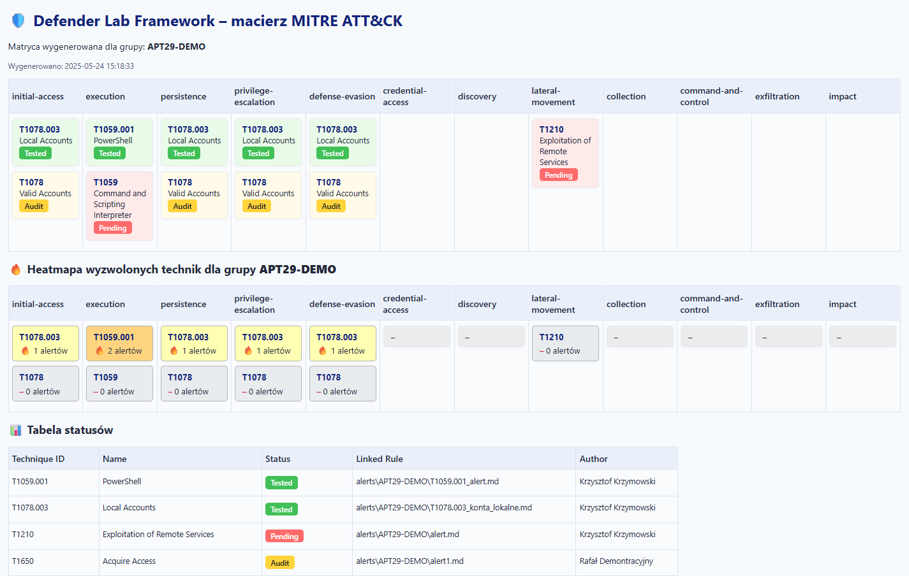

[Przeczytaj tę dokumentację po polsku (README.md)](README.md)

# 🛡️ Defender Lab Framework

**Defender Lab Framework** is a modular environment for **building, testing, mapping and automatically reporting detection scenarios** based on Microsoft Defender for Endpoint (MDE). It allows you to generate technical documentation, HTML reports, layers for the MITRE ATT&CK® Navigator and track detection effectiveness for individual techniques or entire APT groups.

> **A modular framework for testing and documenting detections in MDE with a MITRE heatmap for chosen APT groups**

<p align="center">
  
</p>
---

## What is this framework useful for?

- **Automates documentation and testing of detection scenarios** – every new rule deployment, attack simulation or environment change can be easily documented, mapped to ATT&CK techniques and tested.
- **Generates layers for the MITRE ATT&CK® Navigator** (with status mapping and score) to help analyze detection coverage.
- **Creates interactive HTML reports** (with a heatmap, statuses and filters) that let you quickly review test status, technique coverage and activities linked to MDE alerts.
- **Organizes and standardizes documentation** – scenarios, alerts, hunting rules, mappings and statuses are stored in a logical structure.
- **Facilitates regression tests and development of new detections** – you can return to existing scenarios and extend them, as well as track which techniques have been tested and which still need validation.
- **Supports SOC teams, threat hunters and detection engineers** in gap analysis, planning detection development and reporting to audits or management.

---

## 📁 Project structure

- defender-lab-framework/
- alerts/
- hunting/
- mapping/
- report/
- scenarios/
- tools/
- docs/
- Quickstart.md
- templates/
- defender-lab-framework-template.zip
- README.md

---

## 🏃‍♂️ Quick start

1. **Run the script** (example):
   ```bash
   python tools/main.py
   ```
2. **Choose a mode from the menu:**
   - **SingleTechnique** – individual techniques combined into a single matrix
   - **APT Group** – create a separate matrix for a selected APT group
   - **Update** – mass update based on `status.csv`
   - **APT Matrix from STIX** – automatically generate alerts and `status.csv` for an APT group (results in `mapping/<APT>` and `report/<APT>`)
   - **Global Coverage** – matrix of techniques triggered in the last 30 days (`mapping/global_coverage`, `report/global_coverage`)
   - **AlertEvidence Matrix** – reports based on `tools/helpers/AlertEvidence.csv` (directory `alert_evidence_reports`)
   - **Full Navigator Export** – creates `layer.json` in every `mapping/*` folder
3. **Follow the wizard:**
   The framework will guide you through the process (adding techniques, names, statuses, etc.)
4. **Open generated reports:**
   - HTML reports are in `/report/`
   - Matrices and mappings in `/mapping/`
   - Alerts in `/alerts/`
   - Scenarios in `/scenarios/`

---

## 🗂️ Documentation

- [docs/Quickstart.md](docs/Quickstart.md) — quick start guide explaining how to run the framework and what it generates
- [docs/Pipeline.md](docs/Pipeline.md) — detailed pipeline description
- [docs/FAQ.md](docs/FAQ.md) — questions, tips and best practices
- [docs/Instrukcja update.md](docs/Instrukcja%20update.md) — how to update statuses/scenarios
- [docs/lab-setup-how-configure-tenant/README_lab_setup.md](docs/lab-setup-how-configure-tenant/README_lab_setup.md) — how to configure a tenant for labs

---

## ♻️ Updating statuses/scenarios

You can easily mass update statuses/scenarios:

- Edit `/mapping/NAME/status.csv` (e.g. change the status to Tested, Audit or Pending)
- Use **Update** mode (in the framework wizard) to update reports and the matrix

Details: [docs/Instrukcja update.md](docs/Instrukcja%20update.md)

---

## ℹ️ Additional information

- **MITRE ATT&CK® Navigator:** Layers are generated automatically from statuses and the heatmap (score)
- **Automatic heatmap:** Section showing triggered techniques (from Defender alerts) — color thresholds, scoring and number of occurrences
- **Flexibility:** You can expand the framework and adjust templates and the pipeline to your SOC/threat hunting needs
- **Backup/Archive:** Old versions, experimental scenarios and test files can be found in `/archive`

---

## 📄 License

This project is available under the **MIT** license. You are free to use, develop and share it (fork, modify) under the terms of the license. Please respect the work of others by keeping information about the project authors.

---

## 📣 Contact and development

Have ideas for improvements, found a bug or want to add your own pipeline/scenario? Open an Issue on GitHub or contact the author.

---

> 🛡️ **Defender Lab Framework** — your own system for documenting, testing and developing detections in MDE.
